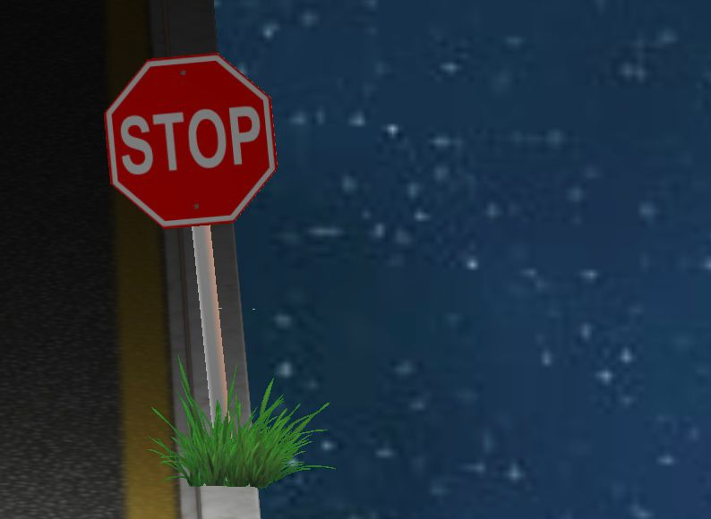
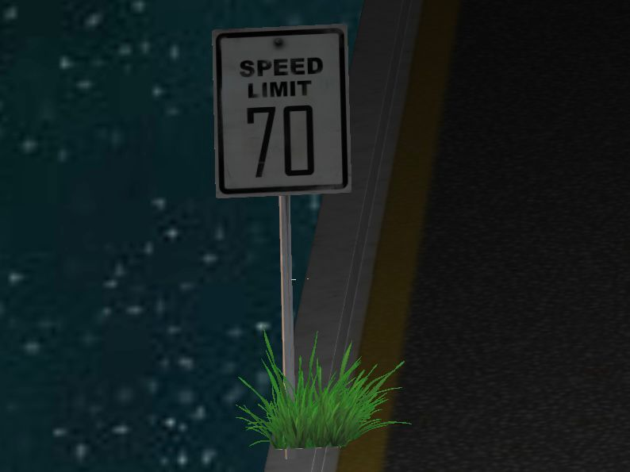

# Računarska grafika, Matematički fakultet

# Anita Jovanović 227/2017

# Komande:
  `W` `A` `S` `D` - kretanje napred, nazad, levo, desno

  `P` - uključivanje/isključivanje osvetljenja

  `T` - uključivanje/isključivanje spotlight-a

# Implementirana oblast: 
 grupa A - Cubemaps (Skybox)

# Snimak projekta: 

# Fotografije: 

